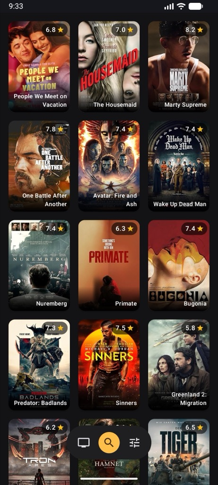
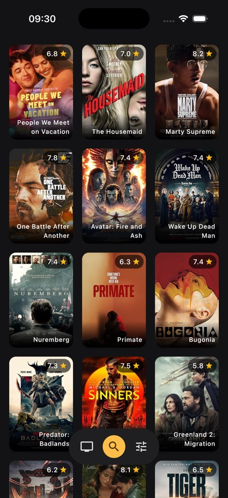
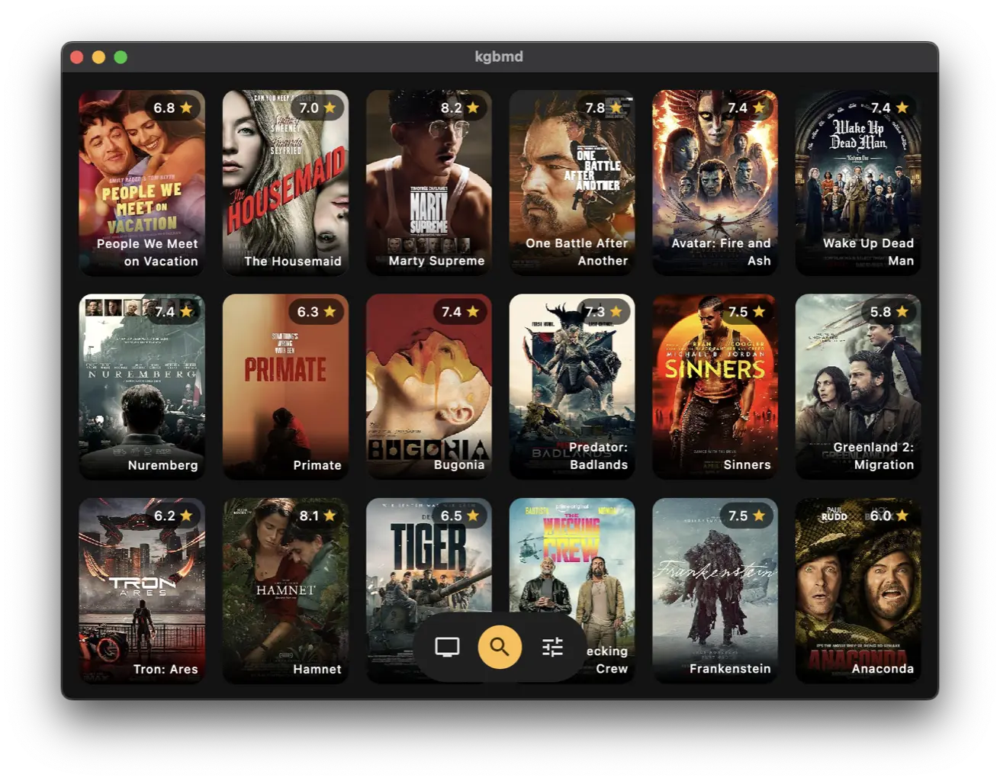

# kgbmd
## Konrad Biernacki (kgbier@gmail.com)

A movie browser written in Kotlin Multiplatform, with Compose Multiplatform UI

| Android                                             | iOS                                             | Desktop                                              |
|-----------------------------------------------------|-------------------------------------------------|------------------------------------------------------|
|  |  |  |

## Features
- Show the IMDB Hot 100 films

## Planned Features
- Show the IMDB hot 100 films and shows
- Search IMDB's database of films, shows and actors, and view film ratings
- Find information on movies and shows, such as top billed actors, creators, etc.
